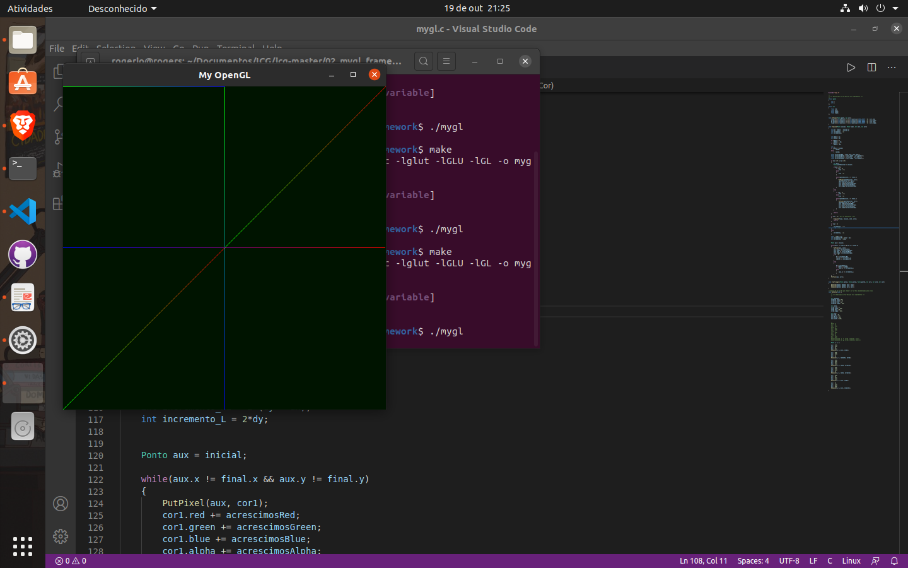

# Introdução à Computação Gráfica
 Estão aqui presentes os trabalhos feitos durante a disciplina de Introdução à Computação Gráfica do Curso de Ciência da Computação da UFPB.
 Here are my class projects during the Intro to Computer Graphics class, Computer Science, at UFPB. 

## Atividade 1

Objetivo: Aparecer um triângulo colorido mostrando que o opengl está funcionando corretamente.
Goal: If opengl is up and running, then a colorful triangle it's going to appear on the screen.

Primeiramente, iremos entrar na pasta onde está o código-fonte e depois usaremos o comando *make* para executar o script de compilação.

Houve alguns *warnings*, como avisado pelo professor. Depois, executamos o arquivo *moderngl_hello_world*. 

Mas ao final, o programa rodou perfeitamente.

 
## Atividade 2

Objetivo: Codar 3 funções: PutPixel, mudar a cor de um determinado pixel, DrawLine, desenhar uma linha pelo algoritmo do Ponto médio, ou Bresenham, e DrawTriangle para desenhar um triângulo recebendo os vértices.
Goal: code 3 functions: Putpixel, to change the color of a given pixel, DrawLine, to draw a Line using Bresenham's algorithm and, finally, drawTriangle to drawing a triangle according to given vertices.

O professor disponibilizou um framework que simula o acesso ao framebuffer. A partir disso, a função PutPixel foi desenvolvida. E, para simplicar, os pixels(pontos, se pensarmos o monitor como um plano com coordenadas i e j) são representados por structs com suas coordenadas salvas. Além disso, tem-se outra struct para representar as cores, com um campo para Red, um para Green, um para Blue e um para Alpha, cada um variando de 0 a 255.

### PutPixel
Nessa função, o ponteiro fb_ptr é acessado para modificar os valores das cores dos pixels usando as coordendas dadas.

### DrawLine
A segunda função foi a mais trabalhosa, pois é aqui que o algoritmo é implementado. Para receber linhas de todos os octantes foi necessário entender que se X ou Y diminuisse, o valor de sua variação seria multiplicada por -1. Após isso, só seguir com o padrão do algoritmo. Aqui também foi implementada a interpolação linear, que daria cor aos pixels da linha.

### DrawTriangle
Por último, mas não menos importante, a função DrawTriangle recebe as coordenadas dos 3 vértices. Foi necessário apenas reutilizar a função anterior para criar três linhas.

### Hard times
A parte mais frustrante do trabalho foi o bug que causava a retidão de algumas linhas. Mas foi resolvido atualizando o valor da variação de y, como dito acima.

*Sem bug*

*Com bug*

